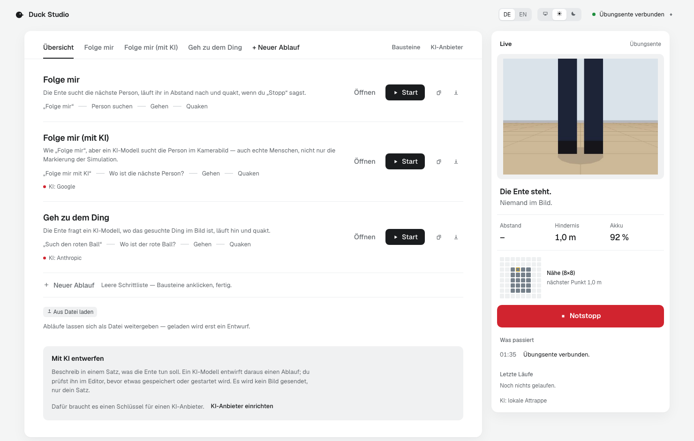
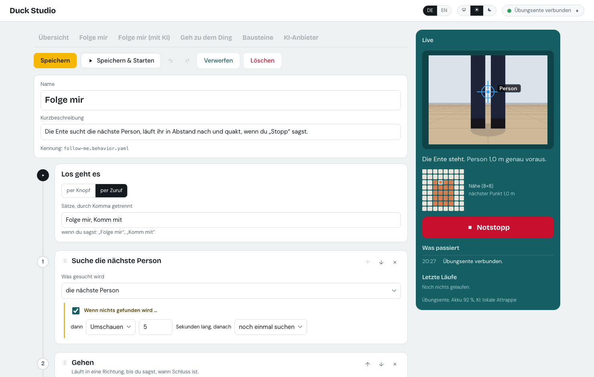
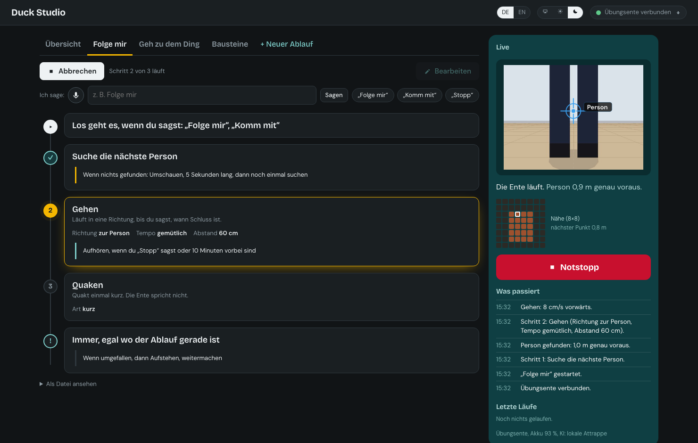

# Duck Studio

A visual studio for building behaviors for the [Microduck](https://github.com/pollen-robotics/microduck)
without writing code: trigger → perception → skills → stop conditions, clicked together as a
vertical step list, tested in simulation, sent to the duck, shared on the Hugging Face Hub.
Underneath sits a small, documented Python runtime that developers can clone, extend and
keep building with Claude Code.

> Not affiliated with Pollen Robotics or Hugging Face. Apache-2.0, like upstream.
> The UI speaks German and English (switch in the top bar; `docs/concepts/languages.md`).
> Code, docs and commits are English.

## What it looks like

Two panes. On the left the route: the overview with every behavior as a card you can read,
open, start, copy or save to a file, then each behavior as one vertical rail of stations. On
the right the stage: what the duck sees and does, and the Notstopp.



Editing happens on the same cards: "Bearbeiten" turns their controls on. Every control comes
from the skill manifest's `ui`, so nothing in the editor knows YAML — the file view sits
below, never in front. Building blocks appear when you add a step, and have their own tab.



Running, in dark mode: the active station glows, finished ones get a tick, the log speaks in
sentences, and the Notstopp stays within reach.



The screenshots come from a real Studio against a real runtime — regenerate them with
`node scripts/screenshots.mjs`.

## Status: M3 + seeing with a model, and a Studio you can steer (2026-09-20)

| Piece | State |
| --- | --- |
| Skill manifest + behavior pack schemas (pydantic, zod, JSON Schema golden files) | done |
| `mock` backend, contract tests, safety gate (clamp · battery · preconditions · rate limit · e-stop bypass) | done |
| Runtime API (`/api/health`, `/api/skills`, `/api/behaviors`, `/api/frame`, `/api/stop`, `/ws/events`) | done |
| Studio shell: skills panel, step list of `follow-me`, live panel with camera + Notstopp + log | done, read-only |
| Upstream API verified against `microduck@344925c` (0.14.1) → `docs/upstream-notes.md` | done |
| `sim` backend: JSON-RPC/NDJSON over duck-sim's Unix sockets, `robot.subscribe` state stream, `tof.stream`, `robot.do`/`robot.sound`, contract tests green against the real daemons and against a protocol double in CI | done |
| `sim/up.sh` wraps upstream `scripts/duck-sim` (no compose upstream, ADR-0002); `sim` is the default backend, the runtime reconnects on its own | done |
| Live panel shows the simulated duck's state (steht / läuft / umgefallen, position, battery) and its camera at 2 fps (`mediad` `GET /frame`, PNG) | done |
| Executor: 10 Hz tick, step list with `on_none` / `until` / `always` branches, heartbeat by resending `robot.move`, watchdog task, gamepad preemption, German event log; 19 mock-based tests incl. fall → getup → resume | done |
| Perception: local magenta-marker detector on the sim camera (bearing + range from ToF column or apparent width), ToF and state feeds into one snapshot | done |
| Follow-me live in duck-sim: „Folge mir“ finds the person, steers toward it, „Stopp“ ends the walk, quack — but the simulated duck does not advance (upstream `microduck_rl#46`, see upstream notes) | partial |
| Studio: Start / Abbrechen, „Ich sage: …“ with trigger chips, active step highlighted, person and state chips in the Live panel | done |
| Studio editor: new behavior from empty, cards from manifest `ui` (choice/select/range/toggle), perceive/wait steps, `until` conditions, always rules, trigger, VLM opt-in with warning, live validation, Speichern / Speichern & Starten / Löschen, YAML developer view | done |
| Runtime: `PUT`/`DELETE /api/behaviors/{id}` write `behaviors/*.behavior.yaml` atomically (ADR-0003), `POST /api/behaviors/validate`, `GET …/yaml` | done |
| VLM perception: swappable provider (Claude or a local stub), `perceive: vlm.target` with a question, `direction: toward_target`, opt-in checked by provider name, call budget (ADR-0004) | done |
| Studio: KI question on the perceive card, target chip and „Bild wird an … gesendet“ in the Live panel | done |
| Live panel: markers for person and KI target drawn on the camera frame, 8×8 ToF proximity grid, one-line status with a step bar | done |
| Editor: insert a step in any gap, drag a card by its grip to reorder (pointer-based, works with a finger), ↑↓ for the keyboard | done |
| Studio opens on an overview of the behaviors (summary, trigger, steps, KI marker, problems) with Öffnen / ▶ Start per card | done |
| Design pass: one token set (`docs/concepts/studio-look.md`), dark mode with a switch, drawn icons instead of emoji, focus rings, columns that scroll on their own | done |
| English as the second language: DE/EN switch, every runtime event bilingual (`runtime/duckstudio/texts.py`), data texts fall back to German, numbers and quotes follow the language | done |
| Hub search in the building blocks panel: browse `microduck-policy` repos, see provenance and what a repo says about its commands, import one as a block that stands in for a builtin (ADR-0005), remove it again | done |
| `duck` backend: an `IpcBackend` behind `scripts/duck-tunnel.sh` (ssh -L), contract suite green against the protocol double through the tunnel's own socket layout (ADR-0006) | prepared |
| Overview: copy a behavior, save it as a file, load one back — schema-checked, renamed if the id is taken, opened as a draft | done |
| Live panel: „Letzte Läufe“ — the last ten runs with duration, how far they got and why they ended (`GET /api/runs`) | done |
| Editor: undo and redo for the draft (Strg+Z / Strg+Umschalt+Z), one entry per move rather than per keystroke | done |
| First run: a nameless new draft, starter templates on the empty overview, measured 21 s from empty Studio to a running behavior ([`docs/m3-acceptance.md`](docs/m3-acceptance.md)) | done |
| Real duck on hardware (M4) | waits for the duck (December) |

Roadmap and rules live in [`CLAUDE.md`](CLAUDE.md); decisions in [`docs/adr/`](docs/adr/).
The first day with real hardware has a list: [`docs/m4-hardware-checklist.md`](docs/m4-hardware-checklist.md).
M3's two-minute criterion is measured, not asserted: [`docs/m3-acceptance.md`](docs/m3-acceptance.md).

## Quickstart (simulation is the normal state)

```bash
# simulation: pinned upstream checkouts, MuJoCo body, the real daemons (needs cargo + uv)
./sim/fetch-upstream.sh
brew install gstreamer libnice-gstreamer   # macOS only, for the simulated camera (mediad)
./sim/up.sh                                # headless, camera on duck-a; DUCK_SIM_CAMERAS= for a blind duck
```

```bash
# runtime (talks to the simulated duck by default; DUCKSTUDIO_BACKEND=mock for a fake one)
cd runtime && uv sync && uv run pytest -q
uv run python -m duckstudio             # http://127.0.0.1:8000/api/health
```

```bash
# studio (second terminal)
cd studio && pnpm install && pnpm dev                        # http://localhost:5173
```

```bash
# a real duck (M4, ADR-0006): one terminal holds the tunnel, the runtime talks to its local end
./scripts/duck-tunnel.sh duck.local
DUCKSTUDIO_BACKEND=duck DUCKSTUDIO_DUCK_HOST=duck.local uv run python -m duckstudio
```

```bash
# optional: let a behavior ask Claude where something is (ADR-0004). Without this the
# runtime answers KI questions with a local stub and no frame ever leaves the machine.
cd runtime && uv sync --extra vlm
export ANTHROPIC_API_KEY=sk-ant-…
DUCKSTUDIO_VLM=anthropic uv run python -m duckstudio        # DUCKSTUDIO_VLM_MODEL, _HZ to tune
```

The Studio talks only to the runtime; the runtime talks to one backend
(`DUCKSTUDIO_BACKEND=sim|mock|duck`, default `sim`). Without a running duck-sim the runtime
says so in the log and retries; the Studio stays usable. With `mock` you get a deterministic
duck that walks when told to, a fake person in the ToF grid and a camera frame.
`DUCKSTUDIO_SIM=1 uv run pytest tests/backends` runs the backend contract against the real
simulator; see `sim/README.md`.

## Layout

```
CLAUDE.md          handover, decisions, working rules (German)
docs/adr/          architecture decision records
docs/concepts/     skill manifest, behavior pack, backend interface, perception, look, languages
docs/schemas/      JSON Schemas (golden files, exported from pydantic)
docs/upstream-notes.md  what we verified about the Microduck API, with commit hashes
runtime/           Python 3.12 · uv · FastAPI · pydantic v2 — executor, backends, API
studio/            React · TypeScript · Vite · Zustand · zod — the visual editor
skills/            *.skill.yaml — building blocks (walk, look_around, quack, getup, ...)
behaviors/         *.behavior.yaml — behavior packs (follow-me, go-to-thing)
sim/               wrapper around upstream duck-sim (pinned checkout, never vendored)
scripts/           duck-tunnel.sh (ssh -L for a real duck), smoke.mjs, firstrun.mjs, screenshots.mjs
package.json       the browser tooling above (playwright); the Studio has its own
```

## Tests

```bash
cd runtime && uv run ruff check . && uv run pytest -q     # 200 tests: contract, safety, executor, API
cd studio  && pnpm typecheck && pnpm test && pnpm build   # 76 tests: schemas, editor model, i18n, transfer
```

What unit tests cannot see — the clicks between the browser and the runtime — is covered by
`scripts/smoke.mjs`: a real browser against a real runtime, walking the overview, the editor
with undo/redo, copy, file export and import, saving and running a behavior, the Notstopp,
and the language and theme switches. Twelve checks, one line each.

```bash
pnpm install                  # root: playwright for the scripts below
pnpm exec playwright install chromium
cd runtime && DUCKSTUDIO_BACKEND=mock DUCKSTUDIO_ROOT=/tmp/ds-smoke uv run python -m duckstudio
cd studio  && pnpm dev                       # or: pnpm build && pnpm preview
node scripts/smoke.mjs                       # STUDIO=http://localhost:4173 for the preview
node scripts/firstrun.mjs                    # the M3 measurement (docs/m3-acceptance.md)
node scripts/screenshots.mjs                 # the pictures above
```

All three jobs run in CI on every push: runtime, studio, and the smoke test against the
built Studio. Every wait in the smoke test waits for a condition, never for a duration — a
slow runner makes it slower, not red.

## Safety, in one paragraph

Only intents and named behaviors ever reach a duck, never joint commands. Every movement
intent passes the `IntentGate`: clamped to the manifest's bounds (upstream clamps nothing),
refused under 15 % battery or when a precondition fails, rate-limited. `stop()` bypasses all
of it. The deadman lives in `robotd` (500 ms); our executor's heartbeat is simply resending
`robot.move`. Camera frames leave the runtime only to your Studio unless a behavior opts into
a VLM by name — the runtime refuses any other provider, logs every send in plain German, the
Studio shows it in red, and a run may ask 200 questions before the asking stops. Tests for
each of these are in `runtime/tests/safety/`.

## Upstream

- [pollen-robotics/microduck](https://github.com/pollen-robotics/microduck) — daemons, `duck-ipc-proto`, `scripts/duck-sim`
- [pollen-robotics/microduck_rl](https://github.com/pollen-robotics/microduck_rl) — MuJoCo + PPO, policies
- [joeynyc/awesome-microduck](https://github.com/joeynyc/awesome-microduck), [joeynyc/microduck-mcp](https://github.com/joeynyc/microduck-mcp) — community
