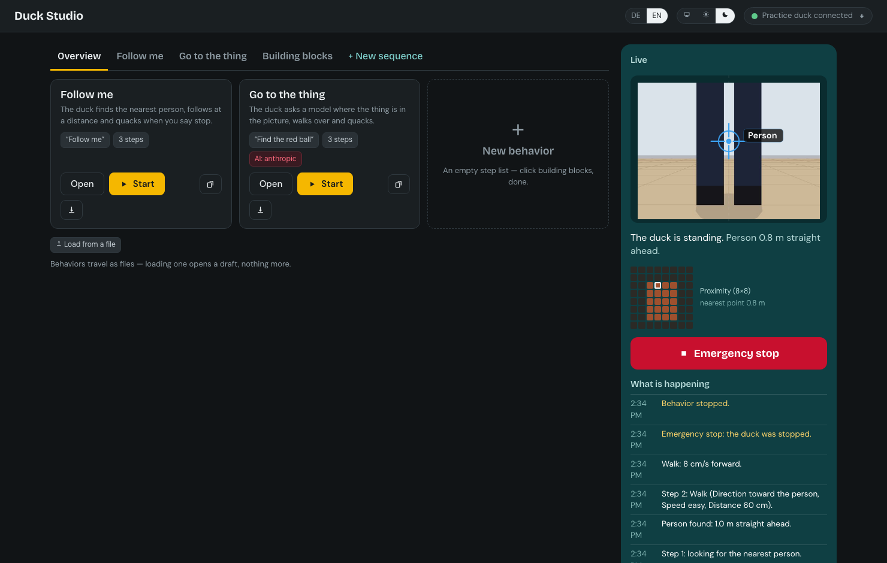

# Two languages

German first, English beside it (`CLAUDE.md` §3.7). Three kinds of text meet in the Studio,
and each is localized in its own place.

## 1. The Studio's own words

`studio/src/i18n/de.json` and `en.json`, looked up with `t("key")`. The switch in the top
bar (DE / EN) writes the choice to `localStorage`; a fresh browser follows
`navigator.languages` and falls back to German. A test asserts that both files have the same
keys and the same `{placeholders}` — a missing translation is a failing build, not a
surprise in the UI.

Numbers, times and quotation marks follow the language too (`number()`, `formatTime()`,
`quote()`): 2,0 m and „so“ in German, 2.0 m and “so” in English.

## 2. What the runtime says

Every event carries both languages: `EventBus.emit(kind, de, en)`, and the sentences live in
`runtime/duckstudio/texts.py` — one function per message, returning `(de, en)`. Nothing in
the runtime knows which language the Studio shows; it sends both and the Studio picks
(`Event.text`). Identifiers (skill ids, signal names, backend kinds) stay in the event's
`data`, never inside the sentence.

The same goes for anything the Studio displays as a reason: the executor's `reason`, a
step's end reason and a VLM target's label are `(de, en)` pairs all the way to the API.

A test walks a whole `follow-me` run and fails if any event lacks an English text.

The log uses the cards' words, not the pack's identifiers: a step reads „Schritt 2: Gehen
(Richtung zur Person, Tempo gemütlich, Abstand 60 cm)“, a command „Gehen: 8 cm/s vorwärts“
rather than `vx 0.08, vyaw 0.0013`. The control and option names (`UI_LABELS`,
`OPTION_LABELS` in `texts.py`) are copies of `ui.*` and `opt.*` in the Studio's dictionaries,
and `tests/texts` fails when the two disagree. Numbers in the German sentences take a comma
(`texts.num`), like the Studio's own.

## 3. What the data says

Skill manifests and behavior packs carry their own `name`, `summary`, `question` and
trigger `phrases` as `{de, en?}`. The Studio shows the current language and falls back to
German (`text()`, `phrases()`): a behavior somebody wrote in German stays German in an
English Studio — nothing here translates content, it only picks what the content offers.

Editing writes the language you are typing in (`setLocalized`). `de` is what the schema
requires, so it is also the fallback: typing English into a pack that has no German fills
both; a pack that carries both keeps the other language untouched.

Speech is language-blind on purpose: `Phrases.all()` gives the runtime every phrase in every
language, so "Follow me" starts the same behavior as „Folge mir“, and a `until: speech`
condition ends a step whichever of its phrases you say.

## What is deliberately not translated

- **Condition strings** (`battery > 0.15`), skill ids, behavior ids: identifiers, in English,
  the same in both UIs (§3.7 — code stays English).
- **The question sent to a model**: the runtime sends the behavior's German question, because
  `de` is the required slot; the Studio shows the question in the reader's language next to
  it. Which language a model is asked in is a behavior's choice, not the Studio's.
- **Validation problems from the runtime** ("unknown skill 'fly'"): they name identifiers and
  are aimed at whoever is building the pack.
